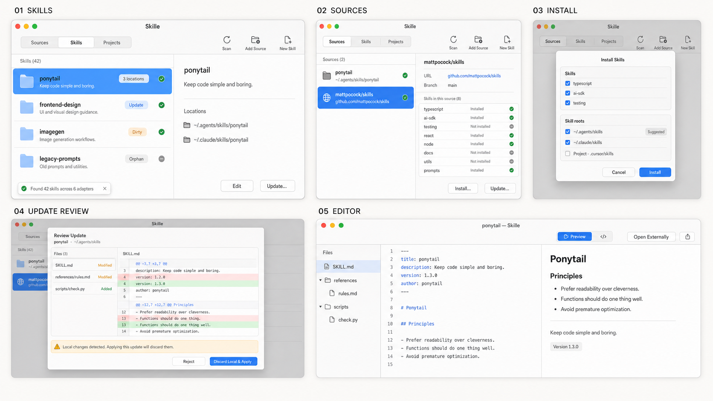

# Skille v1 — UI surface inventory (prototype, revised)

> **Throwaway.** Structural only — for Codex viz + spec §6.  
> Revised for **less is more**: fewer named surfaces, same product power.  
> Prefer **master–detail in one window** over screen stacks; sheets only for commits.

## Critique of the previous draft (what was wrong)

- Too many IDs that were **states or steps**, not surfaces (orphan screen, binary/oversized editor screens, “R6 → U”, separate Accept vs Dirty screens).
- First-run **summary modal** fights “zero friction” — Scan already upserts; a toast is enough.
- Projects **folder picker** is the system panel, not our UI.
- Fragmented shell (S0/S0a/S0b/S0c) read like a web IA doc, not a small Mac app.

## Principle

**Three tabs. Lists with an inspector. Sheets for irreversible or multi-field actions. One editor.**

---

## Surfaces (canonical — keep this short)

### 1. Main window

| Region | Role |
|--------|------|
| Tabs | **Sources · Skills · Projects** |
| Toolbar | Scan · Add Source · New Skill (Skills-centric actions can also live as list empty-state / “+”) |
| Content | Master–detail (list + inspector) per tab |
| Toast | Scan finished / inventory changed / source fetch done / errors |

No separate Settings surface in v1 viz or MVP chrome (adapter toggles = fog / later).

### 2. Skills tab (default home)

| Pane | Role |
|------|------|
| **List** | One row per **logical skill** or **orphan**. Badges: location count, update, dirty. |
| **Inspector** | Locations for that skill; primary actions: **Edit**, **Update…** (if provenance + update), **Attach Source…** (if orphan). |

Orphans are **not** a separate screen — same list/inspector, Attach emphasized when `logicalSkillId` is null.

**Edit:** if one location → open Editor; if several → small **location chooser** (menu or one-shot sheet), not a full page.

### 3. Sources tab

| Pane | Role |
|------|------|
| **List** | Skill Sources (URL, branch, update hint). |
| **Inspector** | Skills found in repo + which are installed where. Actions: **Install…**, **Update…** (checklist). |

### 4. Projects tab

| Pane | Role |
|------|------|
| **List** | Project paths + Add / Remove. Add opens **system** folder picker only. |

Skills from projects still appear on **Skills** (badge) — no second skill browser.

### 5. Editor (one surface)

File tree · text editor · markdown preview when appropriate.  
Non-text: Quick Look / Open externally (in-place behavior, not a screen).  
Oversized text: inline “too large” + open externally.

Opened from Skills inspector (per location). Can be a second window or replace detail — **one** editor chrome either way.

---

## Sheets / alerts (only these)

| Sheet | Fields / job |
|-------|----------------|
| **Add Source** | Git URL, branch (default main/master) |
| **Install** | Multi-select packages in source × multi-select skill roots (default suggest `.agents/skills`) |
| **Attach Source** | URL + path in repo; confirm if joining existing logical skill |
| **New Skill** | Name, description, target skill root(s) → Agent Skills scaffold |
| **Update checklist** | From Source: check locations with updates → Continue |
| **Update review** | Per location: file list (text expandable; binary = status+size); **Accept** / **Reject**; if dirty → **Discard local & apply** (alert or same sheet mode) |

Shared update review for: Source checklist item **and** Skills inspector “Update…”.

---

## First launch (no extra screens)

1. App opens → **silent Scan** (+ optional source update checks).  
2. Land on **Skills** (or empty Skills with CTAs: Add Source, Add Project).  
3. Toast: “Found N skills across M adapters” when useful.

Dropped: dedicated scan-progress page and mandatory summary → Continue gate.

---

## Functionality map (nothing lost)

| Job | Where |
|-----|--------|
| Discover local skills | Scan + Skills list |
| Manage repo mini-libraries | Sources list/inspector |
| Install from git (multi skill × multi root) | Install sheet |
| Batch update from repo | Update checklist → Update review |
| Single-skill update | Skills inspector → Update review |
| Edit on disk | Editor |
| Author new skill | New Skill sheet |
| Wire orphan to git | Attach Source sheet |
| Project scope | Projects list |
| Diff / dirty gate | Update review |

---

## Codex viz set (fewer, sharper)

1. **Main · Skills** — list + inspector (mix of sourced + orphan badges)  
2. **Main · Sources** — multi-skill repo inspector (e.g. ponytail / mattpocock/skills)  
3. **Install sheet** — skills × roots  
4. **Update review** — diff list + Accept (and a dirty-gate variant if you generate a second frame)  
5. **Editor** — tree + markdown  

Optional 6th: **empty Skills** with two CTAs. Skip first-run wizard frames.

---

## Verdict

Previous inventory was **complete but over-sliced**. This revision keeps full v1 behavior with **~5 real chrome surfaces** (window tabs + editor) and **~6 sheets/alerts**, which is the right weight for a lightweight Swift control layer.
